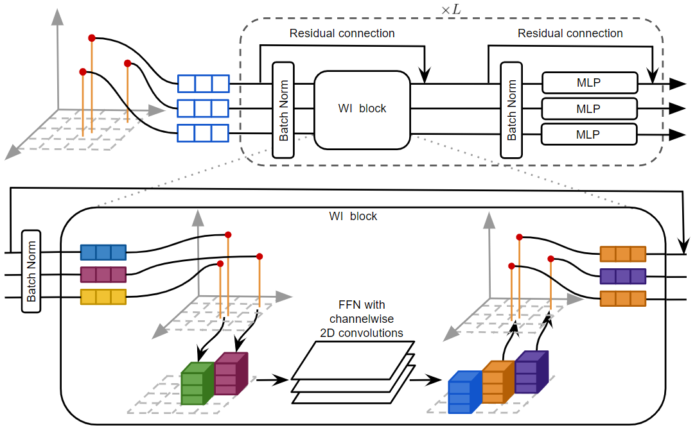

# WaffleIron



[**Using a Waffle Iron for Automotive Point Cloud Semantic Segmentation**]()  
[*Gilles Puy*<sup>1</sup>](https://sites.google.com/site/puygilles/home),
[*Alexandre Boulch*<sup>1</sup>](http://boulch.eu),
[*Renaud Marlet*<sup>1,2</sup>](http://imagine.enpc.fr/~marletr/)  
<sup>1</sup>*valeo.ai, France* and <sup>2</sup>*LIGM, Ecole des Ponts, Univ Gustave Eiffel, CNRS, France*.

If you find this code or work useful, please cite the following [paper]():
```
@article{puy23waffleiron,
  title={Using a Waffle Iron for Automotive Point Cloud Semantic Segmentation},
  author={Puy, Gilles and Boulch, Alexandre and Marlet, Renaud},
  journal={arxiv:2301.xxxx}
  year={2023}
}
```

## Installation

```
pip install pyaml==6.0 tqdm=4.63.0 scipy==1.8.0 torch==1.11.0 tensorboard=2.8.0
git clone https://github.com/valeoai/WaffleIron
cd WaffleIron
pip install -e ./
```

Download the pretrained models:
```
wget https://github.com/valeoai/WaffleIron/files/10294733/info_datasets.tar.gz
tar -xvzf info_datasets.tar.gz
wget https://github.com/valeoai/WaffleIron/files/10294734/pretrained_nuscenes.tar.gz
tar -xvzf pretrained_nuscenes.tar.gz
wget https://github.com/valeoai/WaffleIron/files/10294735/pretrained_kitti.tar.gz
tar -xvzf pretrained_kitti.tar.gz
```

Finally, indicate where the nuScenes and SemanticKITTI datasets are located on your system:
```
export PATH_NUSCENES="/PATH/TO/NUSCENES"
export PATH_KITTI="/PATH/TO/KITTI/"
```

If you want to uninstall this package, type `pip uninstall waffleiron`.


## Testing pretrained models

### Option 1: Using this code

To evaluate the pre-trained model on the train set of nuScenes used in Table 1 of our paper, type
```
python launch_train.py \
--dataset nuscenes \
--path_dataset $PATH_NUSCENES \
--log_path ./pretrained_models/WaffleIron-48-256__60cm-baseline-nuscenes/ \
--config ./configs/WaffleIron-48-256__60cm-baseline-nuscenes.yaml \
--fp16 \
--gpu 0 \
--restart \
--eval
```

To evaluate the pre-trained model on the train set of SemanticKITTI, with instance cutmix augmentation, type
```
python launch_train.py \
--dataset semantic_kitti \
--path_dataset /gpfswork/rech/kvd/uyl37fq/data/semantic_kitti \
--log_path /gpfsscratch/rech/kvd/uyl37fq/temp/pretrained_models/WaffleIron-48-256__40cm-BEV-cutmix-kitti/ \
--config ./configs/WaffleIron-48-256__40cm-BEV-cutmix-kitti.yaml \
--fp16 \
--restart \
--eval
```

**Remark:** *On SemanticKITTI, the code above will extract object instances on the train set (despite this 
being not necessary for validation) because this augmentation is activated for training on this dataset (and this code
re-use the training script). This can be bypassed by editing the `yaml` config file and changing the entry 
`instance_cutmix` to `False`. The instances are saved automatically in `/tmp/semantic_kitti_instances/`.*

### Option 2: Using the official APIs

The second option writes the predictions on disk and the results can be computed using the official 
nuScenes or SemanticKITTI APIs. This option also allows you to perform test time augmentations, which is not possible 
with Option 1 above. These scripts should be useable for submission of the official benchmarks.

#### nuScenes

To extract the prediction with the pre-trained model on nuScenes, type
```
python eval_nuscenes.py \
--path_dataset $PATH_NUSCENES \
--config ./configs/WaffleIron-48-256__60cm-baseline-nuscenes.yaml \
--ckpt ./pretrained_models/WaffleIron-48-256__60cm-baseline-nuscenes/ckpt_last.pth \
--result_folder ./predictions_nuscenes \
--phase val \
--num_workers 12
```
or, if you want to use, e.g., 10 votes with test time augmentations,
```
python eval_nuscenes.py \
--path_dataset $PATH_NUSCENES \
--config ./configs/WaffleIron-48-256__60cm-baseline-nuscenes.yaml \
--ckpt ./pretrained_models/WaffleIron-48-256__60cm-baseline-nuscenes/ckpt_last.pth \
--result_folder ./predictions_nuscenes \
--phase val \
--num_workers 12 \
--num_votes 10 \
--batch_size 5
```
You can reduce `batch_size` to 2 or 1 depending on the available memory.

These predictions can be evaluated using the official nuScenes API as follows
```
git clone https://github.com/nutonomy/nuscenes-devkit.git
python nuscenes-devkit/python-sdk/nuscenes/eval/lidarseg/evaluate.py \
--result_path ./predictions_nuscenes \
--eval_set val \
--version v1.0-trainval \
--dataroot $PATH_NUSCENES \
--verbose True  
```

#### SemanticKITTI
/gpfswork/rech/kvd/uyl37fq/data/semantic_kitti

To evaluate the pre-trained model on SemanticKITTI, type
```
python eval_kitti.py \
--path_dataset /gpfsdswork/dataset/SemanticKITTI \
--ckpt pretrained_models/WaffleIron-48-256__kitti/ckpt_last.pth \
--config ./configs/WaffleIron-48-256__kitti.yaml \
--result_folder /gpfsscratch/rech/kvd/uyl37fq/monoscene_preprocess/kitti/waffleiron_v2 \
--phase val \
--num_workers 3 \
--num_votes 10 \
--batch_size 5
```


NOTE: Val set
No vote: 68.0 mIoU
TTA 10: 69.9 mIoU
```
python eval_kitti_robo3d.py \
--path_dataset /gpfsdswork/dataset/SemanticKITTI \
--ckpt pretrained_models/WaffleIron-48-256__kitti/ckpt_last.pth \
--config ./configs/WaffleIron-48-256__kitti.yaml \
--result_folder /gpfsscratch/rech/kvd/uyl37fq/monoscene_preprocess/kitti/waffleiron_v2 \
--phase val \
--num_workers 8 \
--num_votes 10 \
--batch_size 5
```


```
python eval_kitti_origin.py \
--path_dataset /gpfsdswork/dataset/SemanticKITTI \
--ckpt pretrained_models/WaffleIron-48-256__kitti/ckpt_last.pth \
--config ./configs/WaffleIron-48-256__kitti.yaml \
--result_folder /gpfsscratch/rech/kvd/uyl37fq/monoscene_preprocess/kitti/waffleiron_test_tta \
--phase val \
--num_workers 8 \
--num_votes 10 \
--batch_size 5

/gpfsscratch/rech/kvd/uyl37fq/temp/prediction_kittis/
The predictions can be evaluated using the official APIs by typing
```
git clone https://github.com/PRBonn/semantic-kitti-api.git
cd semantic-kitti-api/
python evaluate_semantics.py \
--dataset /gpfsdswork/dataset/SemanticKITTI/dataset \
--predictions /gpfsscratch/rech/kvd/uyl37fq/monoscene_preprocess/kitti/waffleiron_test \
--split valid
```

## Training

### nuScenes

To train a WaffleIron-48-256 backbone on nuScenes with 
- 2D cells of 60 cm,
- the baseline sequence of projections along the z-axis, then the y-axis, then the x-axis, etc., until the last layer,

type
```
python launch_train.py \
--dataset nuscenes \
--path_dataset $PATH_NUSCENES \
--log_path ./logs/WaffleIron-48-256__60cm-baseline-nuscenes/ \
--config ./configs/WaffleIron-48-256__60cm-baseline-nuscenes.yaml \
--gpu 0 \
--fp16
```

For example, with `--seed 1` as additional arguments in `launch_train.py`, I obtain 76.2 % in mIoU at the last 
training epoch (using one Nvidia Tesla V100S-PCIE-32GB for training).

Note: for multi-GPUs training, you can remove `--gpu 0` and the code will use all available GPUs using PyTorch DataParallel 
for parallelism. You can add the argument `--multiprocessing-distributed` to use DistributedDataParallel instead.


### SemanticKITTI

To retrain a WaffleIron-48-256 backbone on SemanticKITTI with
- 2D cells of 40 cm,
- projection along the z-axis at all layers,
- **instance cutmix augmentations**,

type
```
python launch_train.py \
--dataset semantic_kitti \
--path_dataset $PATH_KITTI \
--log_path ./logs/WaffleIron-48-256__40cm-BEV-cutmix-kitti \
--config ./configs/WaffleIron-48-256__40cm-BEV-cutmix-kitti.yaml \
--fp16 \
--multiprocessing-distributed
```

The instances for cutmix augmentation are saved in `/tmp/semantic_kitti_instances/`. You can disable the instance 
cutmix augmentations by editing the `yaml` config file to set `instance_cutmix` to `False`.

For submission to the official benchmark on the test set of SemanticKITTI, we also trained the network on both the 
val and train sets (argument `--trainval` in `launch_train.py`), used the checkpoint at the last epoch and 10 test 
time augmentations during inference.


## Creating your own network

### Config file

You can refer to `./config/WaffleIron-template.yaml` where we describe the role of each parameter. 
In particular, you can adjust `nb_channels` and `depth` to increase of decrease the capacity of WaffleIron.
You can also adjust the memory required to train a network by adjusting `max_points` in `dataloader`, but a 
too small value might impact the performance.

### Models

The WaffleIron backbone is defined in `waffleiron/backbone.py` and can be imported in your project by typing
```python
from waffleiron import WaffleIron
```
It needs to be combined with a embedding layer to provide point tokens and a pointwise classification layer, as we do 
in `waffleiron/segmenter.py`. You can define your own embedding and classification layers instead.


## Acknowledgements
We thank the authors of 
```
@inproceedings{berman18lovasz,
author = {Berman, Maxim and Triki, Amal Rannen and Blaschko, Matthew B.},
title = {The Lovász-Softmax Loss: A Tractable Surrogate for the Optimization of the Intersection-Over-Union Measure 
in Neural Networks},
booktitle = {CVPR},
year = {2018}
}
```
for making their [implementation](https://github.com/bermanmaxim/LovaszSoftmax) of the Lovász loss publicly available.


## License
WaffleIron is released under the [Apache 2.0 license](./LICENSE). 

The implementation of the Lovász loss in `utils/lovasz.py` is released under 
[MIT Licence](https://github.com/bermanmaxim/LovaszSoftmax/blob/master/LICENSE).
